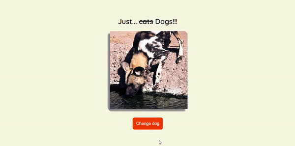

## Javascript Assíncrono

### Promisse

Promises são objetos assíncronos.
Esses objetos podem ser resolvidos ou rejeitados.
Primises tem três estágios pending, fulfilled e rejected.

### Async

O javascript funciona de forma sincrona.
Sempre que você quiser o resultado de uma promise é necessario usar o método await, para que esse possa ser processado.

### API

Applicaion programming interface.
Comumente apresentada com a extensão .json, e sendo apresentada em forma de objeto.
Conecta o back com o front atrvés de um sistema, que costuma ser apresentado em urls.

### Fetch

O fetch retorna uma promise, por isso é possivel utilizar o encadiamento de then.
Quando utilizado o fetch é necessario o uso do await.

## Atividade: API "<s>catAPI</s> DogAPI"

Nesta atividade, vamos criar uma página que carrega fotos aleatórias de <s>gatinhos</s> cachorros sempre que clicamos em um botão.

1. Utilize a API <s>`https://thatcopy.pw/catapi/rest`</s> `https://dog.ceo/api/breeds/image/random` para fazer as chamadas com o método `fetch()`;
2. Utilize seus conhecimentos na manipulação do DOM para criar a imagem e ativar o evento de clique do botão!

